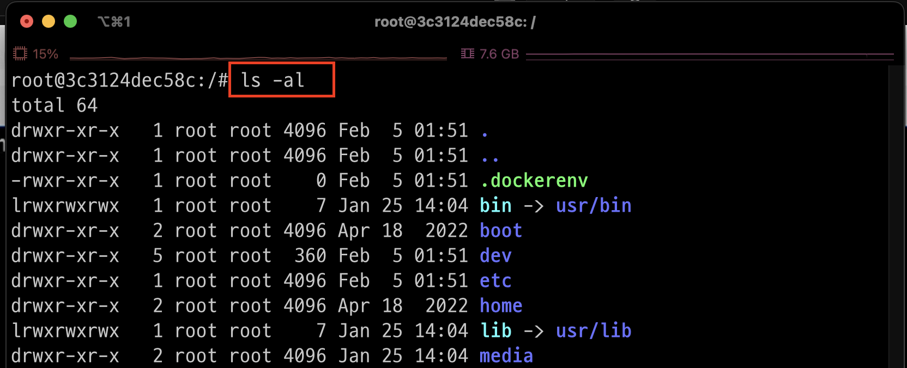
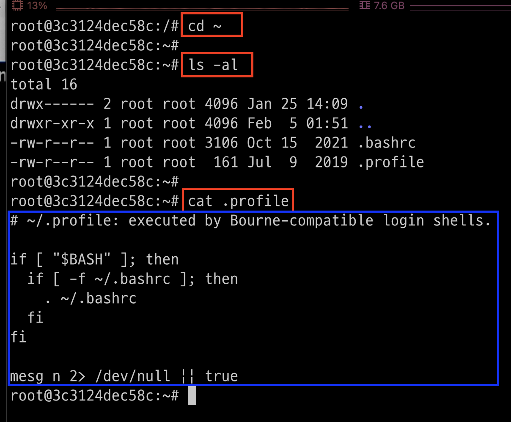
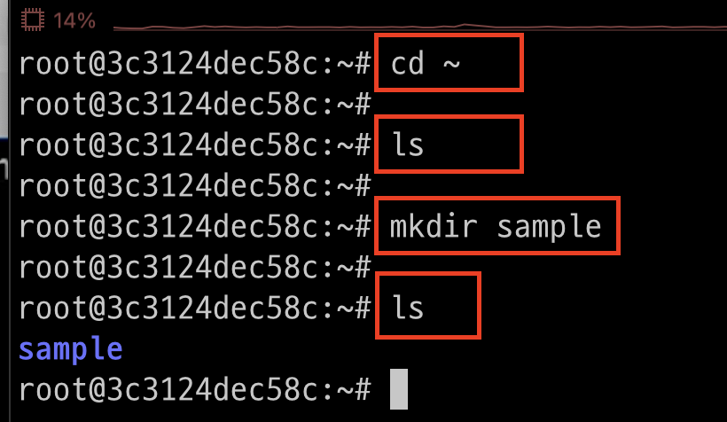
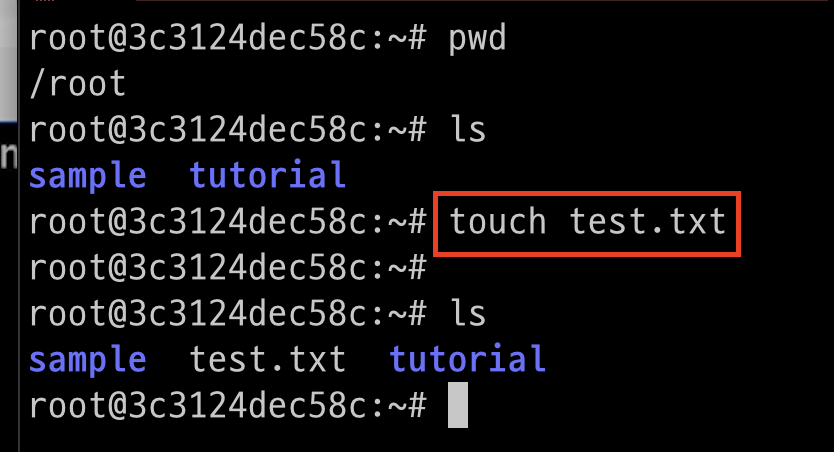
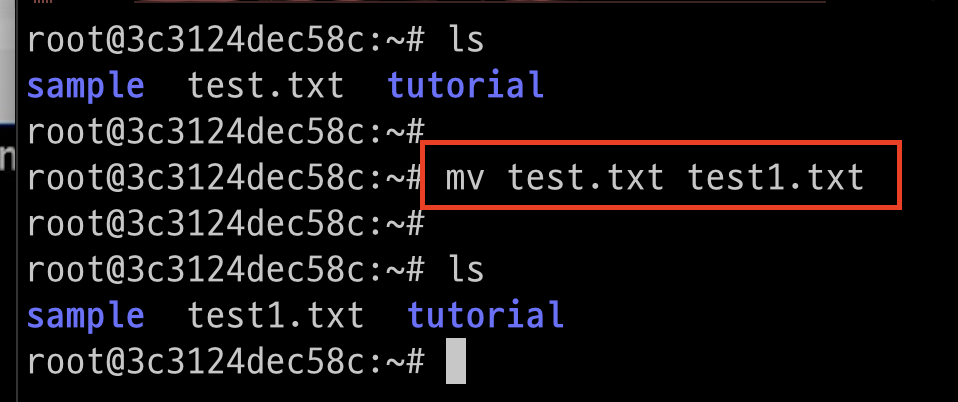
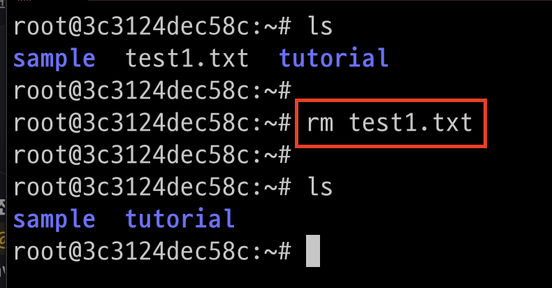

# 기본명령어
- 리눅스 명령어는 결구 쉘이 제공하는 명령어임 
- 따라서 리눅스 기본 명령어는 bash에서 제공하는 명령어임
---
### 단계1: whoami
- 로그인한 사용자ID를 알려줌 
```shell
whoami
```


---
### 단계2: apt / apt-get
- 우분투(Ubuntu)를 포함안 데비안(Debian)계열의 리눅스에서 쓰이는 팩키지 관리 명령어 도구입니다.
- apt를 쓰든 apt-get(또는 apt-cache)을 쓰든 내부 동작의 차이는 거의 없습니다.

---
- 업데이트할 패키지들의 목록을 최신으로 갱신한다. 실제로 패키지를 업그레이드 하는게 아니다.
```shell
apt-get update
```


---
- update 로 갱신된 최신 패키지들을 실제로 업그레이드 한다.
```shell
apt-get upgrade
```


---
- upgrade 는 의존성 체크를 하지 않고 업그레이드하지만 dist-upgrade는 의존성 체크를 하면서 위의 upgrade에서 수행되지 못한 dependency 까지 설치해준다. 
```shell
apt-get dist-upgrade
```


---
- 패키기/라이브러리 설치
- 명령어: apt-get install -y <라이브러리명>
```shell
apt-get install -y tree
```


---
### 단계3: ls 
- 파일 목록 출력 
```shell
ls
```


---
- `-a`: 모든 파일 표시 
- `-l`: 파일에 관한 상세 정보 표시 
```shell
ls -al
```


---
### 단계4: clear
- 터미널 화면을 깨끗하게 
```shell
clear
```


---
### 단계5: cd
- 디렉토리 이동 
- 명령어: cd <디렉토리 path>
  - `cd ~`: 해당 계정의 홈 디렉토리로 이동 
  - `cd ..`: 상위 디렉토리로 이동 
```shell
cd dev
```


---
### 단계6: pwd
- 현재 디렉토리 위치 
```shell
pwd 
```


---
### 단계7: cat 
- 파일내용출력 
- 명령어: cat <파일명>
```shell
cat .profile
```


---
```shell
cat /root/.profile
```


---
### 단계8: mkdir 
- 폴더 생성  
```shell
mkdir sample
```


---
- `-p`: 부모폴더가 없다면 같이 생성
```shell
mkdir -p /root/tutorial/test
```


---
### 단계9: touch
- 빈 파일 생성 
- 명령어: touch <파일명>
```shell
touch test.txt
```


---
### 단계10: mv
- 이름변경 또는 이동 
- 명령어: mv <이동할 파일> <이동될 파일>
```shell
# 이름변경 
mv test.txt test1.txt
```


---
```shell
# 이동
mv test1.txt /root/sample/test1.txt
ls # 기존 파일 확인 > 없음 
```


---
### 단계11: cp
- 파일이나 디렉토리를 복사 
- 명령어: cp <복사할 파일> <복사될 파일>
```shell
cp test1.txt /root/test1.txt
ls # 기존 파일 확인 
ls /root # 복사한 파일 확인 
```


---
- `-r `: 하위 디렉토리 까지 모두 복사합니다.
```shell
cp -r /root/sample /root/tutorial 
ls /root/tutorial/sample
```


---
### 단계12: rm
- 파일이나 디렉토리 삭제 
- 명령어: rm <삭제할 파일>
```shell
rm test1.txt
``` 


---
- `-r`: 디렉토리 삭제 
```shell
rm -r sample
``` 


